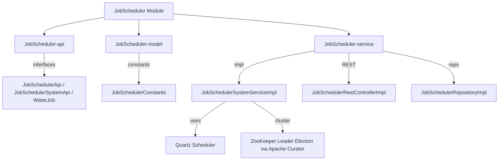
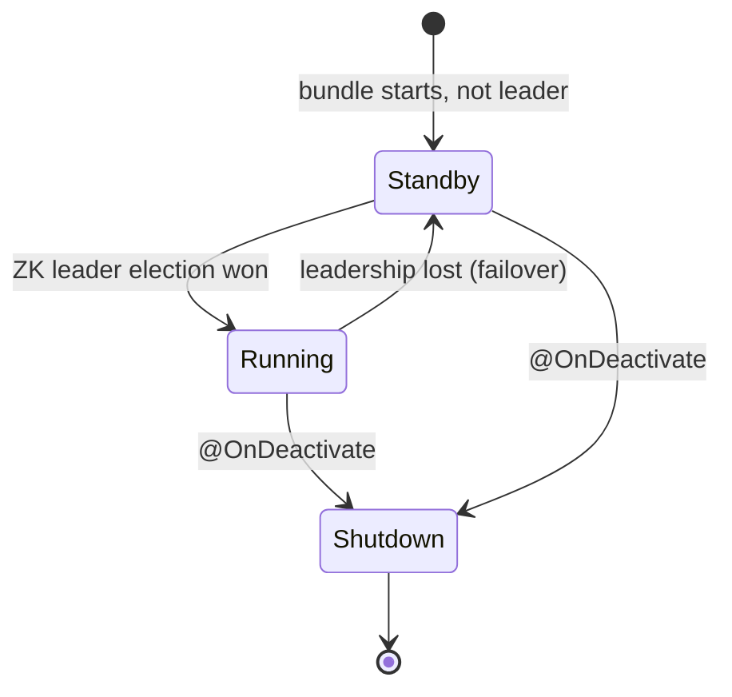

# JobScheduler Module

The **JobScheduler** module provides cluster-aware Quartz 2.3.2 job scheduling for Water Framework services. Jobs are defined via the `WaterJob` interface, scheduled with cron expressions, and executed only on the cluster leader node (determined via ZooKeeper/Apache Curator leader election).

## Architecture Overview



## Sub-modules

| Sub-module | Description |
|---|---|
| **JobScheduler-api** | Defines `JobSchedulerApi`, `JobSchedulerSystemApi`, `WaterJob`, and `JobSchedulerRepository` |
| **JobScheduler-model** | `JobSchedulerConstants` (no JPA entities) |
| **JobScheduler-service** | Service implementations, repository, and REST controller |

## WaterJob Interface

```java
public interface WaterJob {
    String getClassName();               // Fully-qualified Quartz Job implementation class
    String getCronExpression();          // Cron expression (e.g., "0 0/5 * * * ?")
    JobDetail getJobDetail();            // Quartz JobDetail object
    JobKey getJobKey();                  // Quartz JobKey (name + group)
    Map<String, Object> getJobParams();  // Parameters passed to the job at execution
    boolean isActive();                  // Whether to schedule this job (false = skip)
}
```

## API Interfaces

### JobSchedulerSystemApi (System — no permission checks)

| Method | Description |
|---|---|
| `addJob(WaterJob)` | Schedule a new job (validates cron before adding) |
| `deleteJob(WaterJob)` | Remove job from Quartz scheduler |
| `updateJob(WaterJob)` | Reschedule job with updated cron expression |

### JobSchedulerApi (Public — with permission checks)

Extends `BaseApi` — permission system integrated, delegates to `JobSchedulerSystemApi`.

## Cluster Behavior



Jobs execute **only on the cluster leader**. On leader failover, the new leader's scheduler transitions from STANDBY to RUNNING automatically.

## REST Layer

`JobSchedulerRestApi` / `JobSchedulerRestControllerImpl` are currently generator placeholders.
The module does not expose a concrete HTTP contract yet, so there is no real REST CRUD surface,
no executable Karate suite, and no Bruno collection to keep in sync.
If concrete JAX-RS methods are added in the future, test that boundary with Karate only.

## Usage Example

```java
@Inject
private JobSchedulerSystemApi jobScheduler;

// Define a job
public class MyReportJob implements WaterJob {
    public String getClassName() { return "com.example.ReportGenerator"; }
    public String getCronExpression() { return "0 0 6 * * ?"; } // Every day at 06:00
    public JobDetail getJobDetail() { return JobBuilder.newJob(ReportGenerator.class)
        .withIdentity(getJobKey()).build(); }
    public JobKey getJobKey() { return JobKey.jobKey("daily-report", "reports"); }
    public Map<String, Object> getJobParams() { return Map.of("format", "PDF"); }
    public boolean isActive() { return true; }
}

// Schedule it
jobScheduler.addJob(new MyReportJob());

// Update cron
jobScheduler.updateJob(new MyReportJob() {
    public String getCronExpression() { return "0 0 8 * * ?"; } // Move to 08:00
});

// Remove
jobScheduler.deleteJob(new MyReportJob());
```

## Configuration

| Property | Description |
|---|---|
| `it.water.connectors.jobscheduler.quartz.*` | Standard Quartz properties |
| ZooKeeper settings | Inherited from `ZookeeperConnector` if present |

Common Quartz properties:
- `org.quartz.jobStore.class=org.quartz.impl.jdbcjobstore.JobStoreTX` — JDBC-backed persistence
- `org.quartz.jobStore.class=org.quartz.simpl.RAMJobStore` — In-memory (tests)
- `org.quartz.scheduler.instanceId=AUTO` — Cluster-safe instance ID

## Dependencies

- **Core-api** — `BaseApi`, `BaseSystemApi`, `@FrameworkComponent`, `@OnActivate/@OnDeactivate`
- **Rest-api** — REST controller infrastructure, `@LoggedIn`
- **ZookeeperConnector-api** — ZooKeeper connection for leader election (optional)
- `org.quartz-scheduler:quartz:2.3.2` — Quartz job scheduler
- `org.apache.curator:curator-framework:5.8.0` — ZooKeeper client
- `org.apache.curator:curator-recipes:5.8.0` — `LeaderLatch` for leader election
